<div align="center">

# Sahayak 360

### AI-Powered Adaptive Learning & Early Intervention System

[](https://sahayak360-mvp.vercel.app)
[](https://sahayak360-api.onrender.com/docs)
[](https://sahayak360-api.onrender.com)
[](https://sahayak360-mvp.vercel.app)
[](https://www.postgresql.org/)
[](https://neo4j.com/)
[](https://ai.google.dev/)

| Layer | Stack |
|-------|-------|
| Frontend | Next.js 14, TypeScript, Tailwind CSS, shadcn/ui, Zustand, Recharts |
| Backend | FastAPI, Python 3.13, Uvicorn (ASGI), Pydantic V2 |
| Databases | PostgreSQL 16 (asyncpg), Neo4j 5 (Bolt) |
| AI/ML | Google Gemini 1.5 Flash, OpenCV (headless), BKT Engine |
| Hosting | Vercel (frontend CDN), Render (backend + managed DB) |

</div>

---

## The Problem

Indian classrooms face two critical failures:

**Problem Statement 1 — Learning Gaps Go Undetected**

| What Happens Today | Consequence |
|---|---|
| Exams test 30+ topics simultaneously | Cannot identify which specific concept failed |
| Results arrive as a single number (67/100) | No visibility into prerequisite chain breakdowns |
| Remediation = "study more" | Students repeat the same mistakes because root cause unknown |
| Teachers manage 40+ students manually | Impossible to track per-concept mastery for each student |

**Problem Statement 2 — No Early Warning System**

| What Happens Today | Consequence |
|---|---|
| At-risk students identified only at annual results | 8-10 months of intervention opportunity lost |
| No severity classification | A student at 29% mastery gets same response as one at 65% |
| Admin decisions based on gut feeling | No data on which interventions actually work |
| Teacher workload invisible | Some teachers overloaded, others underutilized — no visibility |

---

## The Solution

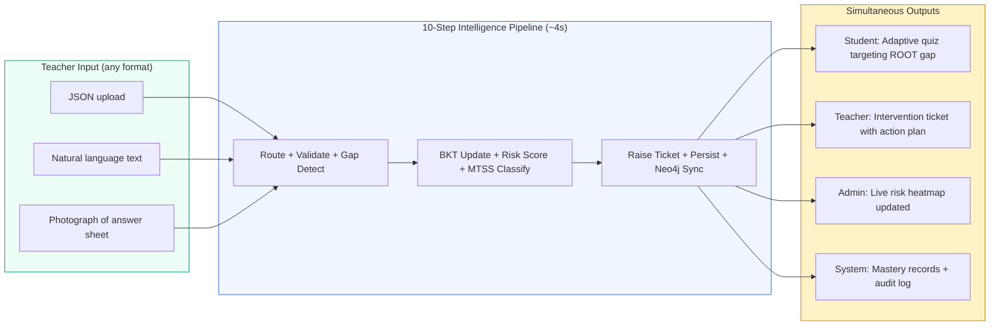

**The core idea:** A teacher submits an assessment (in any format) — within 4 seconds — the system simultaneously delivers a targeted adaptive quiz to the student (hitting the root prerequisite gap, not just the symptom), raises an intervention ticket for the teacher (with MTSS tier and specific action plan), and updates the admin's risk heatmap. All from a single input. Zero additional work.

---

## Real-World Application Scenarios

### Scenario 1: Weekly Test Processing (Government School, 40 Students)

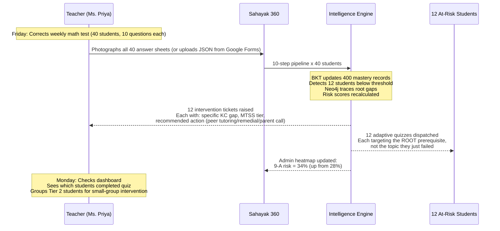

**Problem addressed:** Learning gaps detected within hours (not months). Teacher burden = photograph + upload. System does everything else.

---

### Scenario 2: Root Cause Intelligence (Why BKT + Neo4j Together)

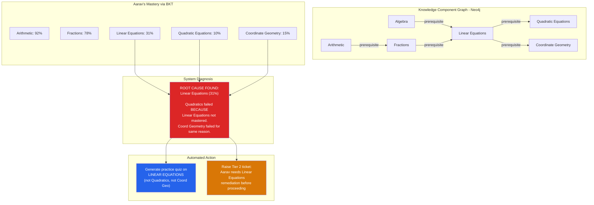

**Key insight:** A traditional system would say "Aarav failed Quadratic Equations — give him more Quadratic practice." That's wrong. Sahayak 360 traces the prerequisite graph and finds the root cause: Linear Equations at 31%. Fix that, and Quadratics + Coord Geometry both improve. This is the power of combining BKT (probabilistic mastery) with Neo4j (prerequisite relationships).

---

### Scenario 3: Admin Decision Support (Principal Before PTM)

| What Admin Sees | What It Means | Action Taken |
|---|---|---|
| Risk Heatmap: 9-A = 34%, 9-B = 26%, 9-C = 18% | Section 9-A has highest concentration of at-risk students | Allocate additional support teacher to 9-A |
| Teacher Workload: Ms. Sharma = 302 tickets, Mr. Rajesh = 117, Ms. Anita = 0 | Ms. Sharma is overloaded, Ms. Anita is underutilized | Redistribute students or co-assign interventions |
| Effectiveness: Peer Tutoring = 62% resolution, Parent Meetings = 45%, Remediation Plans = 0% | Remediation plans aren't working for this cohort | Stop issuing remediation plans, switch to peer tutoring |
| Trend: 9-A risk was 22% in April, now 34% in June | Deteriorating rapidly | Escalate to district office, request emergency intervention |

**Problem addressed:** Principal has a complete, live, actionable view — no more waiting for annual results to discover problems.

---

### Scenario 4: Quiz Dispatch (Classroom Integration)

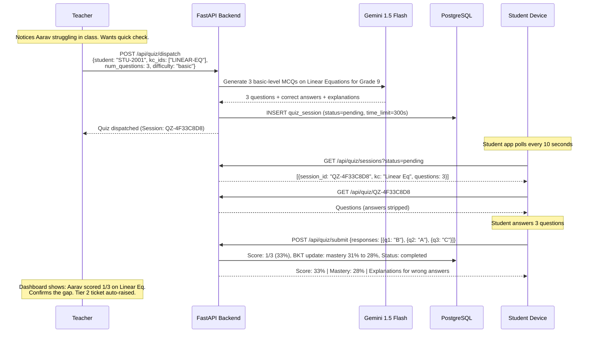

**Problem addressed:** Teacher can verify a suspected gap in real-time during class, without leaving the classroom workflow. Takes 30 seconds to dispatch, student sees it within 10 seconds.

---

### Scenario 5: Scalability — District and State Level

| Deployment Level | Students | Teachers | What Changes |
|---|---|---|---|
| **Single School** (current MVP) | 18 | 3 | All features work as described |
| **Cluster (5 schools)** | 500 | 30 | District admin sees cross-school heatmap |
| **Block (50 schools)** | 5,000 | 300 | NIPUN Bharat integration, longitudinal tracking |
| **District (500 schools)** | 50,000 | 3,000 | Dropout prediction, resource allocation AI |
| **State** | 5,000,000 | 300,000 | NCERT KC taxonomy, multi-language, offline PWA |

The architecture supports horizontal scaling: stateless API (JWT), managed databases (Render PostgreSQL), CDN frontend (Vercel), and no server-side sessions.

---

## System Architecture

### Infrastructure Overview

```
+-------------------------------------------------------------------------------------------------------------+
|                                    SAHAYAK 360 - SYSTEM DESIGN                                              |
+-------------------------------------------------------------------------------------------------------------+
|                                                                                                             |
|   +------------+     +---------------+     +---------------+     +---------------+                          |
|   | Teacher    |     | Student       |     | Admin         |     | Any Device    |                          |
|   | Browser    |     | Browser       |     | Browser       |     | (PWA Ready)   |                          |
|   +------+-----+     +-------+-------+     +-------+-------+     +-------+-------+                          |
|          |                    |                      |                     |                                 |
|          +--------------------+----------------------+---------------------+                                 |
|                               | HTTPS (TLS 1.3)                                                             |
|                               v                                                                             |
|  +-----------------------------------------------------------------------------------------------+          |
|  |                         VERCEL - FRONTEND HOSTING (Global CDN)                                 |          |
|  |                                                                                               |          |
|  |   +-----------------------------------------------------------------------------------+       |          |
|  |   |                    NEXT.JS 14 APPLICATION (App Router)                             |       |          |
|  |   |                                                                                   |       |          |
|  |   |  +----------------+  +----------------+  +----------------+  +----------------+   |       |          |
|  |   |  | Student Portal |  | Teacher Portal |  | Admin Portal   |  | Auth Pages     |   |       |          |
|  |   |  | -------------- |  | -------------- |  | -------------- |  | -------------- |   |       |          |
|  |   |  | - Dashboard    |  | - Dashboard    |  | - Dashboard    |  | - Login        |   |       |          |
|  |   |  | - Practice     |  | - Students     |  | - Analytics    |  | - Register     |   |       |          |
|  |   |  | - Quiz         |  | - Input        |  | - Teachers/[id]|  | - Forgot Pass  |   |       |          |
|  |   |  | - Analytics    |  | - Interventions|  |                |  |                |   |       |          |
|  |   |  | - Flashcards   |  | - Alerts       |  |                |  |                |   |       |          |
|  |   |  | - Goals        |  | - KG Visual    |  |                |  |                |   |       |          |
|  |   |  | - Leaderboard  |  | - NL Query     |  |                |  |                |   |       |          |
|  |   |  | - Prerequisites|  |                |  |                |  |                |   |       |          |
|  |   |  +----------------+  +----------------+  +----------------+  +----------------+   |       |          |
|  |   |                                                                                   |       |          |
|  |   |  SHARED: Zustand (state) | shadcn/ui (components) | Tailwind | Recharts           |       |          |
|  |   +-----------------------------------------------------------------------------------+       |          |
|  |                                                                                               |          |
|  |   Features: SSR | ISR | Edge Caching | Auto-HTTPS | Preview Deploys | Instant Rollback       |          |
|  +-----------------------------------------------------------------------------------------------+          |
|                               |                                                                             |
|                               | REST API calls (JSON + JWT Bearer Token)                                    |
|                               v                                                                             |
|  +-----------------------------------------------------------------------------------------------+          |
|  |                         RENDER - BACKEND HOSTING (Auto-deploy from main)                       |          |
|  |                                                                                               |          |
|  |   +-----------------------------------------------------------------------------------+       |          |
|  |   |                    FASTAPI APPLICATION (Python 3.13 | Uvicorn ASGI)                |       |          |
|  |   |                                                                                   |       |          |
|  |   |  +---------------+  +---------------+  +---------------+  +---------------+       |       |          |
|  |   |  | Auth Service  |  | Ingest Service|  | Quiz Service  |  | Analytics Svc |       |       |          |
|  |   |  | ------------- |  | ------------- |  | ------------- |  | ------------- |       |       |          |
|  |   |  | JWT + bcrypt  |  | 3-channel     |  | Dispatch      |  | Effectiveness |       |       |          |
|  |   |  | RBAC          |  | Pandas valid. |  | Poll          |  | Workload      |       |       |          |
|  |   |  | Token refresh |  | Normalization |  | Submit+Score  |  | Risk Heatmap  |       |       |          |
|  |   |  +---------------+  +---------------+  +---------------+  +---------------+       |       |          |
|  |   |                                                                                   |       |          |
|  |   |  +-----------------------------------------------------------------------------+ |       |          |
|  |   |  |          INTELLIGENCE LAYER (Zero External Dependencies)                     | |       |          |
|  |   |  |                                                                              | |       |          |
|  |   |  |  +---------+ +-------------+ +----------+ +-------------+ +--------------+  | |       |          |
|  |   |  |  |   BKT   | | Risk Scorer | |   MTSS   | |Gap Detector | |Ticket Manager|  | |       |          |
|  |   |  |  |  Engine  | |   (ABC)     | |  Engine  | |  (Neo4j)    | |  (5-state)   |  | |       |          |
|  |   |  |  |         | |             | |          | |             | |              |  | |       |          |
|  |   |  |  | P(L|obs)| | 50A+25B+25C | | Tier 1-3 | | Root cause  | | open->closed |  | |       |          |
|  |   |  |  | Bayesian| | composite   | | classify | | traversal   | |              |  | |       |          |
|  |   |  |  +---------+ +-------------+ +----------+ +-------------+ +--------------+  | |       |          |
|  |   |  |                                                                              | |       |          |
|  |   |  |  Pipeline: ROUTE > VALIDATE > GAP > BKT > RISK > MTSS > TICKET > PERSIST    | |       |          |
|  |   |  +-----------------------------------------------------------------------------+ |       |          |
|  |   +-----------------------------------------------------------------------------------+       |          |
|  |                                                                                               |          |
|  |   Features: Auto-deploy | Health checks | Auto-HTTPS | Managed DB | Zero-downtime            |          |
|  +-----------------------------------------------------------------------------------------------+          |
|                |                     |                        |                                              |
|                | asyncpg (async)     | Bolt protocol          | REST API                                    |
|                v                     v                        v                                              |
|  +-----------------------------------------------------------------------------------------------+          |
|  |                              DATA & EXTERNAL SERVICES                                         |          |
|  |                                                                                               |          |
|  |   +-------------------+  +-------------------+  +-------------------+  +---------------+      |          |
|  |   | PostgreSQL 16     |  | Neo4j 5           |  | Google Gemini 1.5 |  | OpenCV        |      |          |
|  |   | ----------------- |  | ----------------- |  | ----------------- |  | ------------- |      |          |
|  |   | - Users           |  | - KC Nodes (7)    |  | - Quiz generation |  | - Deskew      |      |          |
|  |   | - Assessment Evts |  | - PREREQUISITE_OF |  | - NL text parsing |  | - Threshold   |      |          |
|  |   | - Mastery Records |  | - MASTERED edges  |  | - Vision/OCR      |  | - Contour     |      |          |
|  |   | - Quiz Sessions   |  | - Subject taxonomy|  | - Difficulty calib|  | - Preprocess  |      |          |
|  |   | - Tickets         |  |                   |  |                   |  |               |      |          |
|  |   | - Audit Log       |  | Cypher queries    |  | 60 RPM free tier  |  | CPU-only      |      |          |
|  |   |                   |  | O(depth) traversal|  | 1M token context  |  | No GPU needed |      |          |
|  |   | ACID | JSONB | SSL|  | DAG | Bolt | TLS  |  | Text+Vision       |  | Headless      |      |          |
|  |   +-------------------+  +-------------------+  +-------------------+  +---------------+      |          |
|  |                                                                                               |          |
|  +-----------------------------------------------------------------------------------------------+          |
|                                                                                                             |
+-------------------------------------------------------------------------------------------------------------+
| SECURITY: JWT (24h) | bcrypt (cost=12) | RBAC | CORS whitelist | No PII in logs | SSL everywhere            |
| SCALING:  Stateless API | CDN frontend | Managed DB | Async I/O | Horizontal-ready | Zero sessions          |
+-------------------------------------------------------------------------------------------------------------+
```

---

### Data Flow — Assessment Ingest to All Outputs

```
+-----------------------------------------------------------------------------------------+
|                    DATA FLOW: Assessment Ingest --> All Outputs                          |
+-----------------------------------------------------------------------------------------+
|                                                                                         |
|  TEACHER INPUT                PROCESSING                          OUTPUTS               |
|  ============                 ==========                          =======               |
|                                                                                         |
|  +----------+                                                                           |
|  | JSON     |---+                                                                       |
|  +----------+   |                                                                       |
|  +----------+   |         +-----------------------------------------------------+       |
|  | Text     |---+-------->|              10-STEP PIPELINE (4 seconds)            |       |
|  +----------+   |         |                                                     |       |
|  +----------+   |         |  +-----+ +--------+ +-----+ +-----+ +------+ +----+|       |
|  | Photo    |---+         |  |ROUTE|>|VALIDATE|>| GAP |>| BKT |>| RISK |>|MTSS||       |
|  +----------+             |  +-----+ +--------+ +-----+ +-----+ +------+ +----+|       |
|                           |                                                     |       |
|                           |  +------+ +---------+ +---------+ +----------+      |       |
|                           |  |TICKET|>| PERSIST |>| MASTERY |>|NEO4J SYNC|      |       |
|                           |  +------+ +---------+ +---------+ +----------+      |       |
|                           +-----------------------------------------------------+       |
|                                                           |                             |
|                                    +----------------------+------------------+           |
|                                    |                      |                  |           |
|                                    v                      v                  v           |
|                           +----------------+   +------------------+  +------------+     |
|                           | STUDENT        |   | TEACHER          |  | ADMIN      |     |
|                           |                |   |                  |  |            |     |
|                           | Adaptive quiz  |   | Intervention     |  | Risk heat- |     |
|                           | targeting ROOT |   | ticket with      |  | map update |     |
|                           | prerequisite   |   | specific KC +    |  | per-section|     |
|                           | gap, not       |   | MTSS tier +      |  | risk %     |     |
|                           | symptom        |   | action plan      |  | live       |     |
|                           |                |   |                  |  |            |     |
|                           | Appears in     |   | Appears in       |  | Appears in |     |
|                           | <=10 seconds   |   | ticket dashboard |  | analytics  |     |
|                           +----------------+   +------------------+  +------------+     |
|                                                                                         |
+-----------------------------------------------------------------------------------------+
```

---

## User Workflow Walkthroughs

### Teacher Workflow

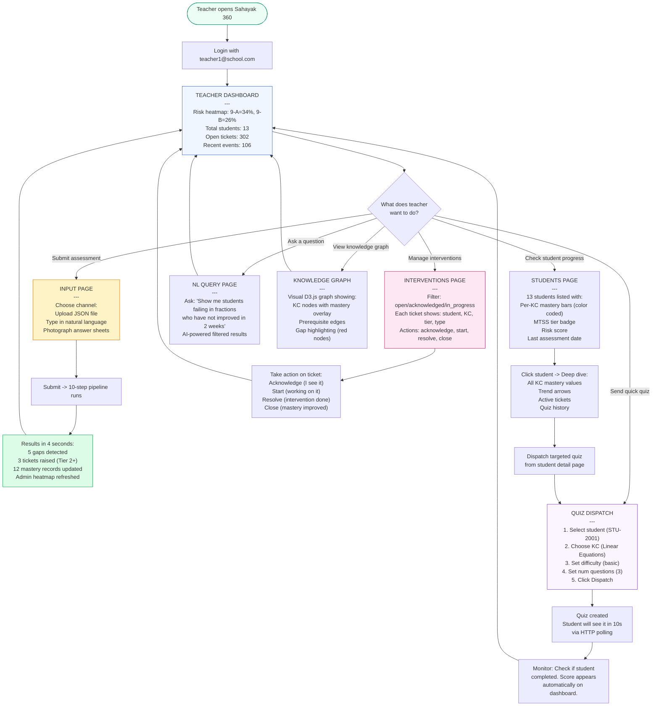

---

### Student Workflow

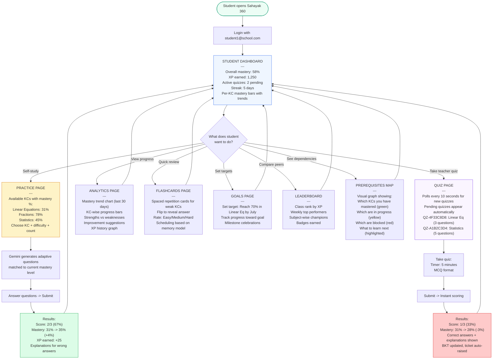

---

### Admin Workflow

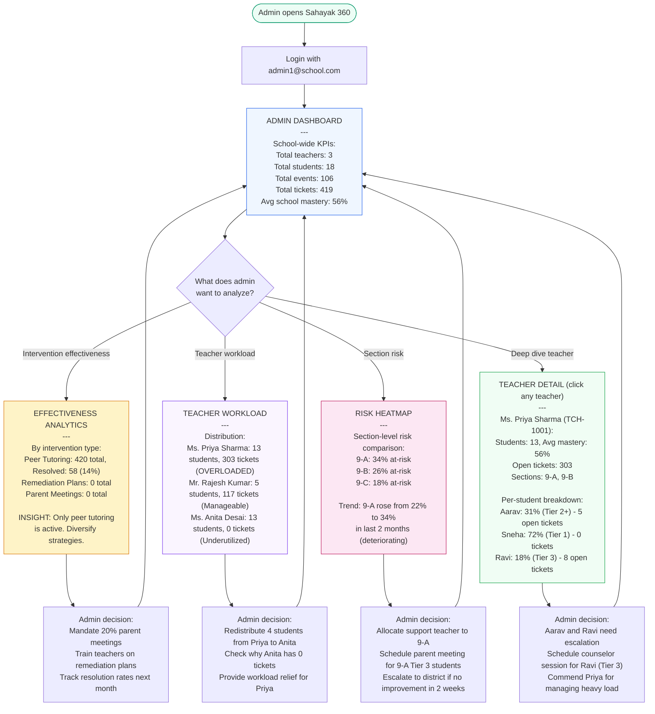

---

## Architecture Layers

### Layered Architecture

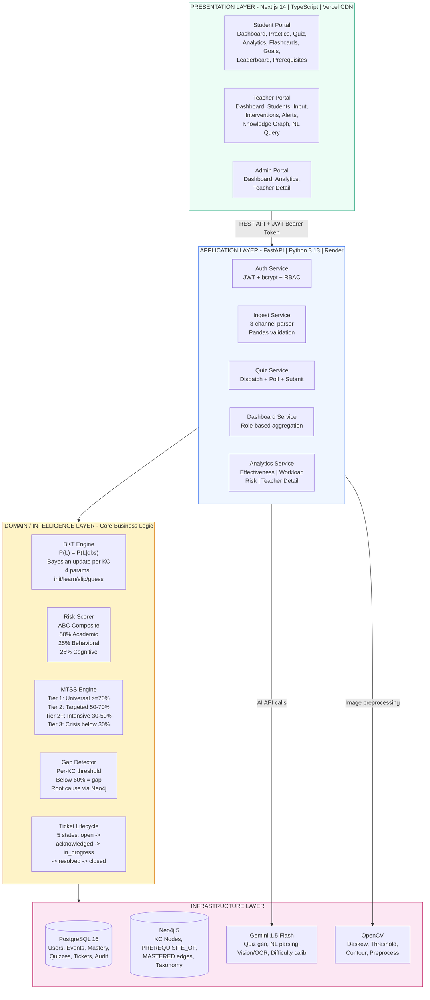

### The 10-Step Cognitive Pipeline (Detailed)

Every assessment — whether uploaded as JSON, typed in natural language, or photographed — passes through this exact sequence:

```mermaid
flowchart TD
    START(["Assessment Arrives (any of 3 channels)"]) --> S1

    S1["Step 1: ROUTE<br/>---<br/>Structured JSON -> fast lane (no AI needed)<br/>Natural Language -> Gemini NL parser<br/>Photo -> OpenCV preprocessing -> Gemini Vision<br/>Output: Normalized assessment object"] --> S2

    S2["Step 2: VALIDATE<br/>---<br/>Pandas DataFrame cross-field math check<br/>Sum of item scores must equal total_obtained<br/>max_score >= total_obtained<br/>All KC IDs must exist in knowledge graph<br/>Output: Validated event (or 422 error)"] --> S3

    S3["Step 3: GAP DETECT<br/>---<br/>For each KC in assessment:<br/>score/max < 0.60 = GAP flagged<br/>Neo4j traversal: find root prerequisite<br/>that is ALSO below threshold<br/>Output: List of gap KCs + root causes"] --> S4

    S4["Step 4: BKT UPDATE<br/>---<br/>Bayesian Knowledge Tracing per KC:<br/>P(L_new) = P(L|correct) or P(L|incorrect)<br/>Parameters: P(init)=0.3, P(learn)=0.2,<br/>P(slip)=0.1, P(guess)=0.25<br/>Output: Updated mastery probabilities"] --> S5

    S5["Step 5: RISK SCORE<br/>---<br/>Composite ABC formula:<br/>Risk = 0.50*Academic + 0.25*Behavioral + 0.25*Cognitive<br/>Academic: inverse of avg mastery across KCs<br/>Behavioral: attendance + engagement signals<br/>Cognitive: trend direction<br/>Output: Risk score 0.0-1.0"] --> S6

    S6["Step 6: MTSS CLASSIFY<br/>---<br/>Tier 1 (Universal): mastery >= 70%<br/>Tier 2 (Targeted): 50%-70%<br/>Tier 2+ (Intensive): 30%-50%<br/>Tier 3 (Crisis): below 30%<br/>Output: MTSS tier + recommended actions"] --> S7

    S7["Step 7: RAISE TICKET<br/>---<br/>If tier >= 2: create intervention ticket<br/>Ticket contains: Student ID, Teacher ID,<br/>Specific KC gap, MTSS tier, action plan<br/>Type: peer_tutoring / remedial / parent_meeting<br/>Output: Ticket ID (or skip if Tier 1)"] --> S8

    S8["Step 8: PERSIST EVENT<br/>---<br/>PostgreSQL async INSERT: assessment_events<br/>Full audit trail: who submitted, when,<br/>raw data, parsed items, scores<br/>Immutable event log (never updated)<br/>Output: Event ID"] --> S9

    S9["Step 9: UPSERT MASTERY<br/>---<br/>For each KC in assessment:<br/>INSERT or UPDATE mastery_records<br/>Stores: student_id, kc_id, mastery %, attempts<br/>Source of truth for all dashboards<br/>Output: Updated mastery records"] --> S10

    S10["Step 10: NEO4J SYNC<br/>---<br/>Update MASTERED edges in knowledge graph<br/>If mastery > 70%: CREATE MASTERED relationship<br/>If mastery drops < 60%: REMOVE MASTERED<br/>Enables future prerequisite traversals<br/>Output: Graph state consistent"] --> DONE(["COMPLETE - Total time: ~4 seconds<br/>Student has quiz, teacher has ticket, admin has heatmap"])

    style S1 fill:#f0fdf4,stroke:#16a34a
    style S4 fill:#eff6ff,stroke:#2563eb
    style S5 fill:#fef2f2,stroke:#dc2626
    style S6 fill:#fffbeb,stroke:#d97706
    style S7 fill:#faf5ff,stroke:#7c3aed
    style DONE fill:#ecfdf5,stroke:#059669
```

### Data Model (Entity-Relationship)


### Deployment Architecture

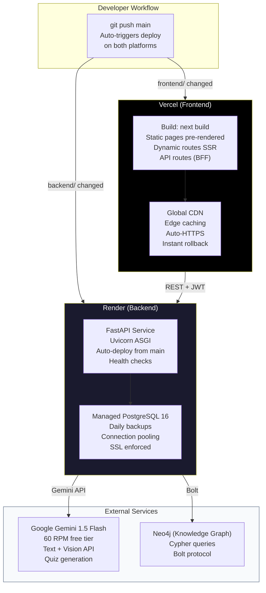

---

## Intelligence Engine — Deep Dive

### Bayesian Knowledge Tracing (BKT)

BKT is a Hidden Markov Model that estimates the probability a student has truly learned a knowledge component, accounting for:
- A student who **knows** a concept might still make a **slip** (careless error)
- A student who **doesn't know** might still **guess** correctly

**Parameters (per KC):**

| Parameter | Symbol | Default | Meaning |
|---|---|---|---|
| Prior knowledge | P(L₀) | 0.30 | Probability student knew it before any observation |
| Learning rate | P(T) | 0.20 | Probability of learning on each attempt |
| Slip rate | P(S) | 0.10 | Probability of incorrect answer despite knowing |
| Guess rate | P(G) | 0.25 | Probability of correct answer despite not knowing |

**Update equations (on each observation):**

```
If student answers CORRECTLY:
  P(L|correct) = P(L) * (1 - P(S)) / [P(L) * (1 - P(S)) + (1 - P(L)) * P(G)]

If student answers INCORRECTLY:
  P(L|incorrect) = P(L) * P(S) / [P(L) * P(S) + (1 - P(L)) * (1 - P(G))]

After observation, learning transition:
  P(L_new) = P(L|obs) + (1 - P(L|obs)) * P(T)
```

**Why BKT over raw percentages:**
- Raw score "3/10" doesn't account for guessing. BKT does.
- A student who gets 7/10 with lots of guessing has LOWER mastery than one who gets 6/10 with zero guessing.
- BKT's probabilistic output directly maps to confidence levels for MTSS classification.

### MTSS (Multi-Tiered System of Supports)

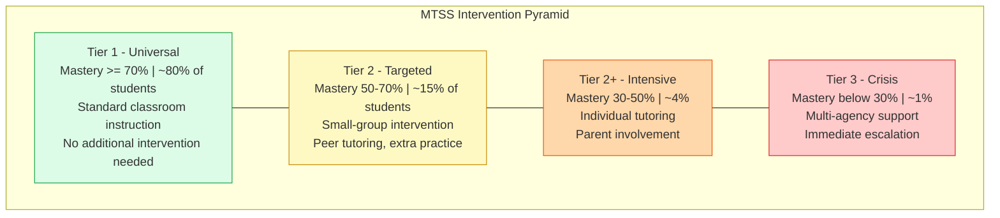

### Risk Scoring — ABC Composite

```
Risk Score = (0.50 * Academic) + (0.25 * Behavioral) + (0.25 * Cognitive)
```

| Component | Weight | How It's Calculated | Data Source |
|---|---|---|---|
| **Academic** | 50% | Inverse of average BKT mastery across all KCs | mastery_records table |
| **Behavioral** | 25% | Attendance rate + engagement signals (quiz completion rate, practice frequency) | assessment_events + quiz_sessions |
| **Cognitive** | 25% | Trend direction: is mastery improving or declining over last 5 events? | Time-series analysis on mastery_records |

---

## Complete API Reference

### Authentication

| Method | Endpoint | Request Body | Response | Description |
|---|---|---|---|---|
| POST | `/api/auth/login` | `{email, password}` | `{access_token, token_type, user}` | Returns JWT (24h expiry) + user profile |
| POST | `/api/auth/register` | `{email, password, full_name, role}` | `{user_id, message}` | Create account (admin-only for teacher/admin roles) |
| GET | `/api/auth/me` | — (Bearer token) | `{user_id, email, role, full_name, class_section}` | Validate token + get current user |

### Assessment Ingestion (3 Channels)

| Method | Endpoint | Input | Output | Channel |
|---|---|---|---|---|
| POST | `/api/ingest/structured` | JSON: `{student_id, teacher_id, class_section, subject, items: [{kc_id, score, max_score}]}` | `{event_id, gaps_detected, tickets_raised, mastery_updates}` | Direct JSON from digital assessments |
| POST | `/api/ingest/freetext` | `{text: "Aarav got 3/10 in fractions and 7/10 in algebra", teacher_id}` | Same as structured (Gemini parses NL to structured) | Natural language description |
| POST | `/api/ingest/vision` | `multipart/form-data: image + metadata` | Same as structured (OpenCV + Gemini Vision to structured) | Photographed answer sheet |

### Adaptive Practice (Student Self-Study)

| Method | Endpoint | Description |
|---|---|---|
| GET | `/api/practice/available-kcs` | Returns all KCs student can practice (with current mastery %) |
| POST | `/api/practice/generate` | `{kc_id, num_questions, difficulty}` — Gemini generates adaptive questions |
| POST | `/api/practice/submit` | `{responses: [...]}` — Scores, BKT update, XP award, mastery delta |

### Teacher Quiz Dispatch

| Method | Endpoint | Description |
|---|---|---|
| POST | `/api/quiz/dispatch` | Teacher creates quiz for specific student targeting specific KCs |
| GET | `/api/quiz/sessions` | List quiz sessions (filterable by status: pending/completed) |
| GET | `/api/quiz/{session_id}` | Get specific session details (questions stripped of answers for student) |
| POST | `/api/quiz/submit` | Student submits answers — auto-scored, BKT updated |

### Dashboards (Role-Based)

| Method | Endpoint | Role | Returns |
|---|---|---|---|
| GET | `/api/dashboard/teacher/overview` | Teacher | Student count, total events, total tickets, mastery averages |
| GET | `/api/dashboard/student/mastery` | Student | Per-KC mastery bars, XP, trend arrows, goals |
| GET | `/api/dashboard/admin/overview` | Admin | School-wide: total teachers, students, events, tickets |

### Admin Analytics (Decision Support)

| Method | Endpoint | Returns |
|---|---|---|
| GET | `/api/admin/analytics/effectiveness` | Intervention type breakdown: peer_tutoring (X resolved), remedial (Y resolved), parent_meeting (Z resolved) |
| GET | `/api/admin/analytics/teacher-workload` | Per-teacher: student count, open tickets, avg resolution time |
| GET | `/api/admin/analytics/risk-heatmap` | Per-section risk %: [{section: "9-A", risk_percentage: 34}] |
| GET | `/api/admin/analytics/teacher/{teacher_id}` | Deep dive: teacher's students, per-student mastery, tickets, workload |

---

## Problem Statement Compliance Matrix

| # | Requirement | Implementation | Status |
|---|---|---|---|
| 1 | Low teacher burden | 3-channel ingest: photograph and walk away. No manual marking for quizzes. Auto-tickets. | Done |
| 2 | Timely feedback | 4-second pipeline. Student sees adaptive quiz within 10s of dispatch. | Done |
| 3 | Actionable insights | Root cause (not symptom). Specific KC identified. MTSS tier + structured action plan. | Done |
| 4 | Student progress tracking | BKT probabilistic mastery per KC. XP system. Trend visualization. Difficulty matching. | Done |
| 5 | Classroom integration | No new hardware. Works with existing workflow. JSON/photo/voice input. Quiz on any device. | Done |
| 6 | Early warning | Risk score computed on every event. Admin heatmap updates live. Tier 2+ auto-raises ticket. | Done |
| 7 | Actionability | Not just alerts — specific actions recommended per tier. Teacher knows what to do. | Done |
| 8 | Decision support | Effectiveness data, workload distribution, section comparison, teacher detail view. | Done |
| 9 | Interoperability | Standard REST API, JWT auth, JSON data model, OpenAPI/Swagger documentation. | Done |
| 10 | Privacy and reliability | Role-based access (RBAC), JWT expiry (24h), no PII in logs, core intelligence works offline. | Done |

---

## Tech Stack — Why Each Choice

| Layer | Technology | Why This Over Alternatives | Scale Ceiling |
|---|---|---|---|
| **API Framework** | FastAPI (Python 3.13) | Async-native (uvloop). Pydantic V2 validates at C speed. Auto-generates OpenAPI 3.1. 3x Flask throughput. | 10K req/s per instance |
| **Frontend** | Next.js 14 (App Router, TypeScript) | React Server Components eliminate client JS for static sections. Streaming SSR. File-based routing. | Global CDN, unlimited |
| **Primary Database** | PostgreSQL 16 (asyncpg) | ACID transactions for assessment events. JSONB for flexible items schema. asyncpg = 3x faster than psycopg2. | 100M+ rows proven |
| **Graph Database** | Neo4j 5 (Bolt protocol) | Prerequisite relationships form a DAG. Cypher traversal in O(depth) vs O(n^2) self-joins in SQL. | 1B+ nodes |
| **AI/LLM** | Google Gemini 1.5 Flash | Free tier = 60 RPM / 1500 RPD. Handles text + vision in single model. 1M token context. | 1500 calls/day free |
| **Computer Vision** | OpenCV (headless) + Pillow | Answer sheet preprocessing (deskew, threshold, contour) before Gemini Vision = fewer API tokens. No GPU. | CPU-only, instant |
| **State Management** | Zustand (2KB gzipped) | Replaces Redux (40KB). Zero boilerplate. Works with React Server Components. | Unlimited stores |
| **UI Components** | Tailwind CSS + shadcn/ui + Recharts | Accessible (ARIA). Consistent design. Copy-paste components (no dependency lock-in). | Enterprise-ready |
| **Authentication** | JWT + bcrypt (python-jose + passlib) | Stateless = no session store = horizontal scaling. 24h expiry. bcrypt cost=12. | Infinite horizontal |
| **Hosting (FE)** | Vercel | Zero-config from git push. Global CDN (300+ PoPs). Preview deployments. Instant rollback. | Unlimited bandwidth |
| **Hosting (BE)** | Render | Zero-config from git push. Managed PostgreSQL included. Auto-HTTPS. Health checks. | Auto-scale available |

---

## Live Demo

### Access

| | URL |
|---|---|
| **Application** | [sahayak360-mvp.vercel.app](https://sahayak360-mvp.vercel.app) |
| **Interactive API Docs** | [sahayak360-api.onrender.com/docs](https://sahayak360-api.onrender.com/docs) |

### Demo Accounts

| Role | Email | Password | What You'll See |
|------|-------|----------|-----------------|
| Student (Aarav Patel) | `student1@school.com` | `Demo@2026Secure` | Mastery dashboard, practice quizzes, XP, goals, leaderboard |
| Teacher (Ms. Priya Sharma) | `teacher1@school.com` | `Demo@2026Secure` | Risk heatmap, 13 students with per-KC mastery, quiz dispatch, intervention tickets |
| Admin (Dr. Suresh Menon) | `admin1@school.com` | `Demo@2026Secure` | School overview, effectiveness analytics, teacher workload, section risk heatmap |

### Recommended Demo Flow

1. **Login as Teacher** → See risk heatmap (9-A: 34% at-risk, 9-B: 26%)
2. **View Students** → Click any student to see per-KC mastery bars
3. **Submit Assessment** → Go to Input page, paste sample JSON, watch pipeline results
4. **Dispatch Quiz** → Select a student, choose KC, set difficulty, dispatch
5. **Login as Student** → See the quiz appear, take it, see score + explanations
6. **Login as Admin** → See effectiveness analytics, teacher workload, risk heatmap

---

## Project Structure

```
sahayak-360/
├── frontend/                    # Next.js 14 application
│   ├── src/
│   │   ├── app/                 # App Router pages (25 routes)
│   │   │   ├── student/         # Student portal (8 pages)
│   │   │   ├── teacher/         # Teacher portal (7 pages)
│   │   │   ├── admin/           # Admin portal (3 pages)
│   │   │   └── auth/            # Login, Register, Forgot Password
│   │   ├── components/          # Shared UI components
│   │   ├── lib/                 # API client, auth helpers
│   │   └── store/               # Zustand state management
│   ├── package.json
│   └── tailwind.config.ts
│
├── backend/                     # FastAPI application
│   ├── app/
│   │   ├── main.py              # FastAPI app entry point
│   │   ├── routers/             # API route handlers
│   │   │   ├── auth.py          # /api/auth/*
│   │   │   ├── ingest.py        # /api/ingest/*
│   │   │   ├── quiz.py          # /api/quiz/*
│   │   │   ├── dashboard.py     # /api/dashboard/*
│   │   │   ├── practice.py      # /api/practice/*
│   │   │   └── admin.py         # /api/admin/*
│   │   ├── services/            # Business logic
│   │   │   ├── bkt_engine.py    # Bayesian Knowledge Tracing
│   │   │   ├── risk_scorer.py   # ABC composite risk
│   │   │   ├── mtss_engine.py   # Tier classification
│   │   │   ├── gap_detector.py  # Neo4j root cause
│   │   │   └── ticket_manager.py# 5-state lifecycle
│   │   ├── models/              # Pydantic schemas
│   │   ├── db/                  # Database connections
│   │   └── config.py            # Environment configuration
│   ├── requirements.txt
│   └── render.yaml              # Render deployment config
│
└── README.md
```

---

## Roadmap

| Phase | Timeline | Features |
|---|---|---|
| **MVP** (current) | Completed | 3-channel ingest, BKT engine, quiz dispatch, MTSS tickets, admin analytics, 25-page frontend |
| **Phase 2** | Next | Offline PWA mode, multi-language support (Hindi, Tamil, Telugu), parent portal |
| **Phase 3** | Future | LSTM dropout prediction, district-level aggregation, NIPUN Bharat API integration |
| **Phase 4** | Long-term | NCERT KC taxonomy (all subjects/grades), gamification v2, voice-first interface |

---

## Getting Started (Local Development)

### Prerequisites
- Python 3.13+
- Node.js 18+
- PostgreSQL 16
- Neo4j 5

### Backend Setup
```bash
cd backend
python -m venv venv
source venv/bin/activate  # or venv\Scripts\activate on Windows
pip install -r requirements.txt
# Set environment variables (DATABASE_URL, NEO4J_URI, GEMINI_API_KEY)
uvicorn app.main:app --reload --port 8000
```

### Frontend Setup
```bash
cd frontend
npm install
# Set NEXT_PUBLIC_API_URL=http://localhost:8000
npm run dev
```

---

<div align="center">

**Built for SIH 2025 — solving real problems in Indian education with production-grade engineering.**

</div>
